# X4 Chem Gate Builder

There is a tool to build gate connections for the game X4 Foundations. This tool has been created to help players to build connection between any sectors in the game. This tool creates a mod (extension) for the game, which can be installed and uninstalled easily.

## Features

Console and graphical user interface (GUI) versions are available. The GUI version is more user-friendly and has more features.

- Build gate connections between any sectors in the game.
- You can build any number of connections.
- Connection - it is a pair of the gates in two sectors.
- You can easily arrange the location of the gates in the sectors.
- In GUI version, after gate is initially defined, you can easily move it to another location.

## Disclaimer

Anybody can use built gate connections in his own mods.
With appropriate credits to the tool and the author.

## Requirements

    You have to have the extracted game files in your computer by the [X Catalog Tool](https://wiki.egosoft.com:1337/X4%20Foundations%20Wiki/Modding%20Support/X%20Catalog%20Tool/)

## Installation

Simple download the latest version of the tool from the [Nexus](https://www.nexusmods.com/x4foundations/mods/1587/) and extract it to any folder.

You can start to build your connections right away.

## Usage

### Console version

Console version is a simple command line tool. You can run it from the command line and follow the instructions.

It has two command line arguments:
[list]
- `--extracted-path` - path to the extracted game files.
- `--log-level` - log level. Possible values: `DEBUG`, `INFO`, `WARNING`, `ERROR`, `CRITICAL`. Default value is `WARNING`.
[/list]

Example:
```bash
x4_chem_gate_builder_cli.exe --extracted-path "C:\X4\extracted" --log-level DEBUG
```

The interface is simple. From the beginning it will propose to you to select first sector ia a first connection:
```bash
? Select a sector: (Use arrow keys)
 » Antigone Memorial (Cluster_28_Sector001_macro) - Source: Vanilla
   Argon Prime (Cluster_14_Sector001_macro) - Source: Vanilla
   Asteroid Belt (Cluster_100_Sector001_macro) - Source: Extension: ego_dlc_terran
   Atiya's Misfortune I (Cluster_26_Sector001_macro) - Source: Vanilla
   Atiya's Misfortune III (Cluster_26_Sector002_macro) - Source: Vanilla
   Atreus' Clouds (Cluster_608_Sector001_macro) - Source: Extension: ego_dlc_boron
   Avarice I (Cluster_500_Sector001_macro) - Source: Extension: ego_dlc_pirates
```

After you select the first sector, it will propose to select the gate position in the sector:
```bash
? Select a sector: Argon Prime (Cluster_14_Sector001_macro) - Source: Vanilla
Existing Connections Zones in Cluster_14_Sector001_macro:
- connection_ClusterGate014To013                     : X:   50.00 km, Y:    0.50 km, Z: -110.00 km, to Second Contact II Flashpoint
- connection_ClusterGate014To007                     : X:  -90.63 km, Y:    0.00 km, Z:   95.91 km, to The Reach
- connection_ClusterGate014To706                     : X:  -94.98 km, Y:    0.00 km, Z:   21.30 km, to Hatikvah's Faith
- connection_ClusterGate014To029                     : X:   50.00 km, Y:    0.50 km, Z:  120.00 km, to Hatikvah's Choice I
Define coordinates for the gate in Argon Prime:
? Enter coordinates in km (X, Y, Z):
```
Additionally provide information about the existing gates in the sector.

After you select entered coordinates, it will propose to define the rotation of the gate:
```bash
? Enter coordinates in km (X, Y, Z): 50,50,50
Define rotation for the gate in Argon Prime:
? Enter rotation angles (roll, pitch, yaw in degrees):
```

After the the same steps will be repeated for the second sector.

When both sectors are selected and a gate is defined in each sector, the tool will ask to enter more connections.
```bash
? Select a sector: Asteroid Belt (Cluster_100_Sector001_macro) - Source: Extension: ego_dlc_terran
Existing Connections Zones in Cluster_100_Sector001_macro:
- connection_ClusterGate100To101                     : X:  -11.52 km, Y:    0.00 km, Z:  136.36 km, to Mars
- connection_ClusterGate100To048                     : X:  114.36 km, Y:    0.00 km, Z:  -61.52 km, to Getsu Fune
- connection_ClusterGate100To107                     : X:   41.41 km, Y:    0.00 km, Z: -130.61 km, to Jupiter
Define coordinates for the gate in Asteroid Belt:
? Enter coordinates in km (X, Y, Z): 50,50,50
Define rotation for the gate in Asteroid Belt:
? Enter rotation angles (roll, pitch, yaw in degrees): 0,0,0
? Will you add one more Gate connection? (y/N)
```

Then you will be asked to generate the mod (extension) for the game:
```bash
? Will you add one more Gate connection? No
? Should be extension files be generated? (Y/n)
```

If you select `Y`, the tool will generate the extension files in the `output` folder.

If it not empty, the tool will ask you to overwrite the existing files:
```bash
? Will you add one more Gate connection? No
? Output directory is not empty. Do you want to clean it? (y/N)
```

and then will generate the extension files.

```bash
? Output directory is not empty. Do you want to clean it? Yes
Script execution completed.
```

As a result, the extension files will be generated in the `output` folder. It will be a folder with name `chem_gate_keeper`.

Simply copy this folder to the `extensions` folder of the game and enable it in the game settings.

### GUI version

GUI version is more user-friendly and has more features.

### First start
On first start, the tool will ask you to select the extracted game files folder.

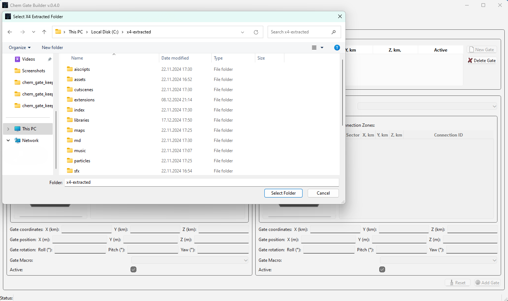

### Main window

After you start the GUI version, you will see the main window with the list of the connections and empty sectors selection
and gate data fields.

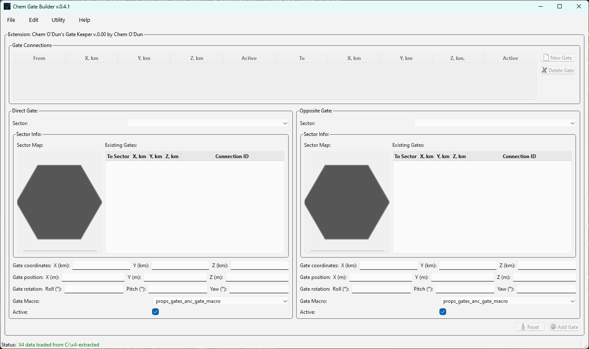

### First sector selection and map

To start, simple select any sector from the list in the `Direct Sector` group.
Then the current gate location will be displayed on the raw and simple sector map and as a list on the right side.

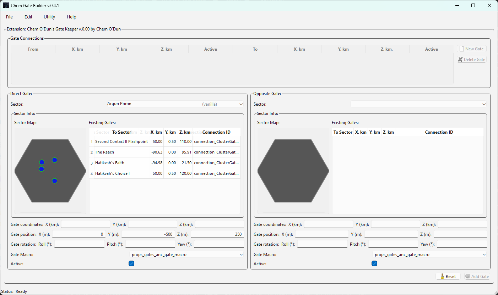

Existing gates displayed as a blue dots with appropriate border color. Red one - are non-active ones, i.e. not connected to any other gate. Green one - are active, i.e. connected to another gate.

### Define gate location

Then you can define the gate location by entering the coordinates and rotation angles.
Please take in account that the coordinates are split into two parts:
[list]
 - coordinates itself, in km.
 - position - the position of from the coordinates point in meters.
[/list]

Position is used to define the exact location of the gate in the sector. and it's randomly prefilled on the gate selection.

### New gate on map

After you will define coordinates, the new gate will be displayed on the map as a light yellow dot.


### Move gate

Now you can select by mouse the move across sector map. Coordinates will be updated in the gate data fields.

How it looks you can see on appropriate animated gif.
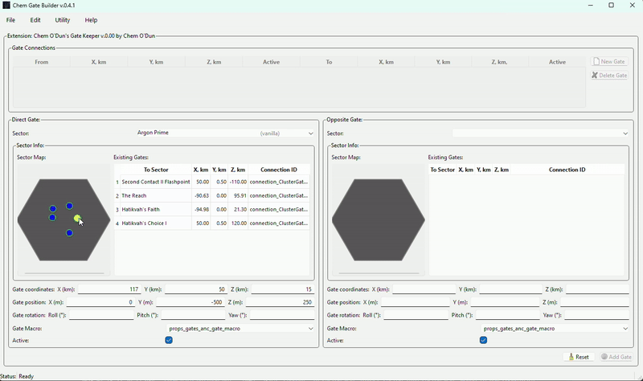

### Other gate data

Then you can define a rotation angles for the gate.

And set the status of the gate - for some reason you can deactivate it (if you plan to use it in your own scenarios).


### Second sector selection

Now you can select the second sector and define the gate location in it.

Please take in account that the in selection list for the second (`Opposite Sector`) some sectors will be grayed out and not available for the selection. It's because the sector is already selected as a first sector or they already have a connection with the `Direct Sector`.

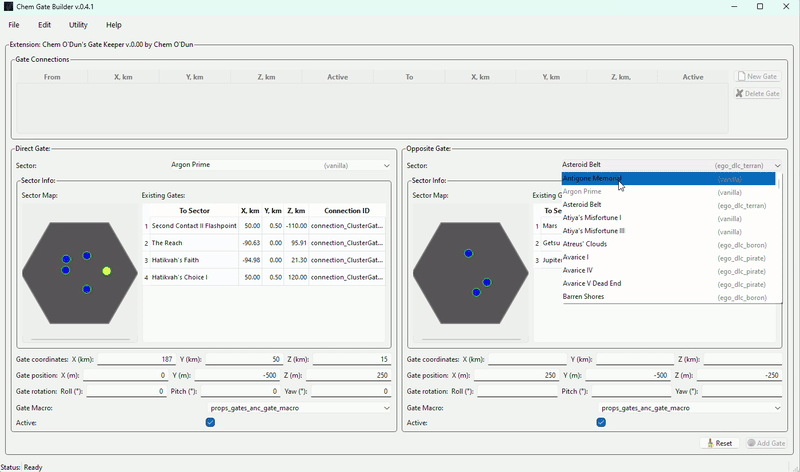

After you will define the gate in the second sector, you can add the connection to the list.

### Add connection

Simple press the `Add Gate` button.

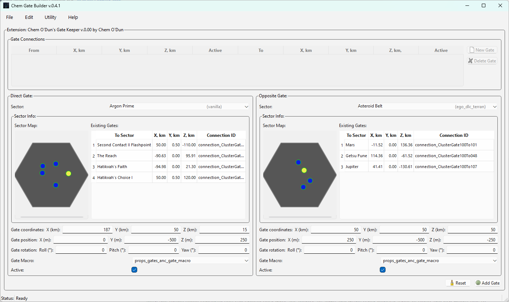

The connection will be added to the list. You can see the connection in the list and still can edit it.

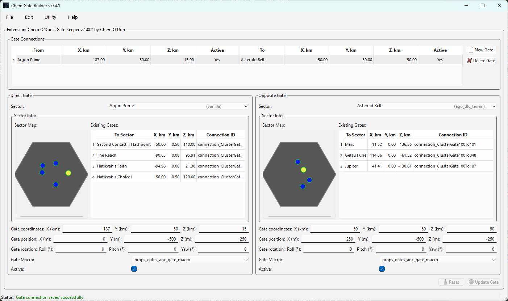

### Modify existing connection

If you will move the gate in the sector for the existing connection - you will see two "identical" gates on the map.
One (`green`) - is the gate from the connection, another (`light yellow`) - is the gate in the new location.

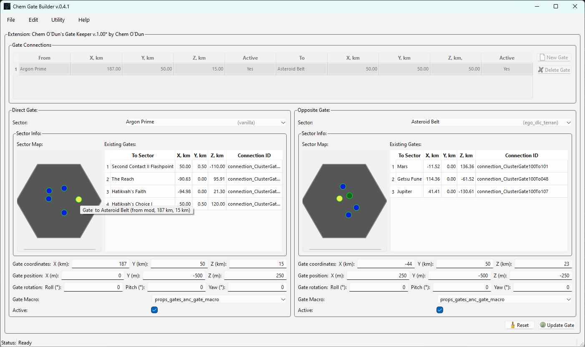

Additionally, as you can see, each gate have a tooltip on the map with the sector name, to which it connects current sector, source (from `map` or from `mod`) and the X,Z coordinates.

### Main window buttons

As you can see, there are two buttons on the bottom of the window:
[list]
- `Add/Update Gate` - to add the gate connection to the list. We already discussed it.
- `Reset` - to reset the gate data fields to the default values. See below for more information.
[/list]

### Reset button

If you have no selected gate connection in the list - reset button will reset all gate connection related information to the defaults, mostly empty values.

Otherwise, it will reset the gate data fields to the values of the selected connection.

So, now you can add more connections to the list.

### Save the mod

When you will finish with the connections, you can save te mod via `File` -> `Save Mod` menu item.

Please take in account - you you not finished yet editing the connections, this menu item will be disabled.

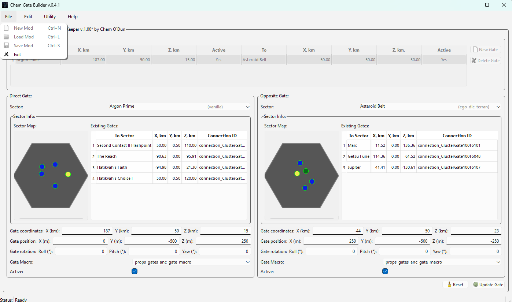

Save current connection or reset it to have the ability to save the mod.

After you will go to the `Save Mod` menu item, the tool will ask you to select the output folder for the mod.

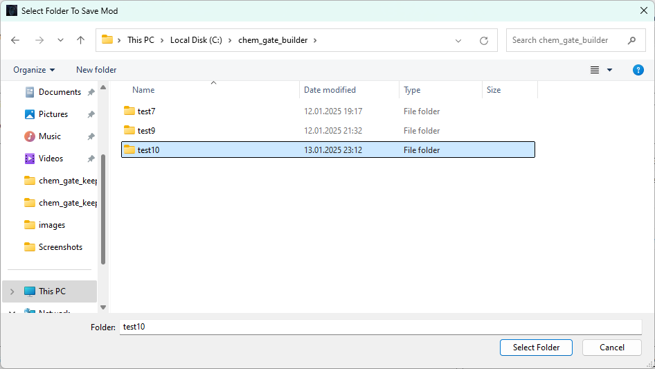

After that the mod is ready to be installed in the game.

### Load the mod

If you have a previously saved mod, you can load it via `File` -> `Load Mod` menu item.
Difference from the saving mod - you hve to select not a mod folder, but the `content.xml` file in the mod root folder.
It was made to avoid missing the right folder.

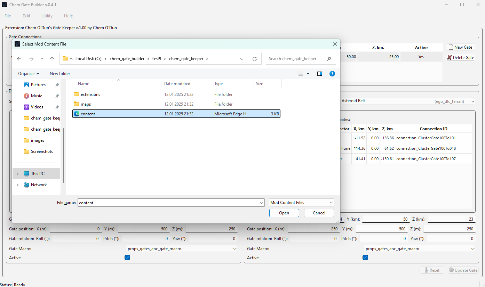

After loading the mod, you will see the connections in the list and the gates on the map. But no current connection will be selected.

### Overview mod in a tool and in the game

There a gif to display the mod gates ti compare it with a screenshots from the game.

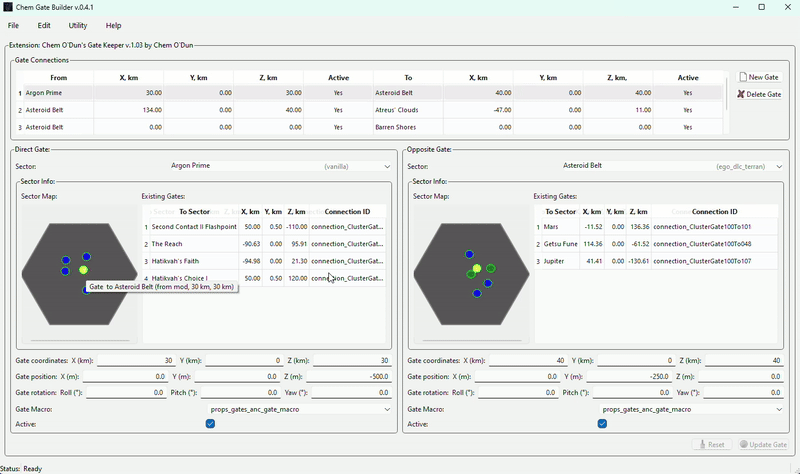

And there a several screenshots from the game with the mod gates in the `Asteroid Belt` sector.

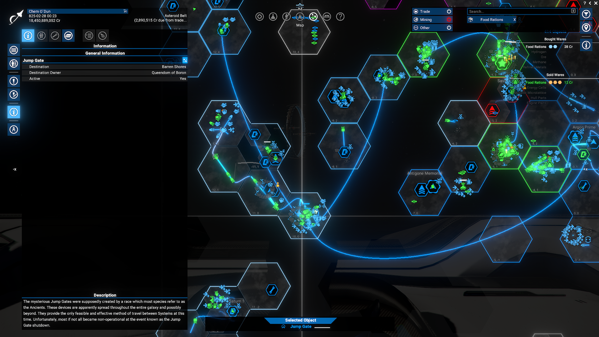

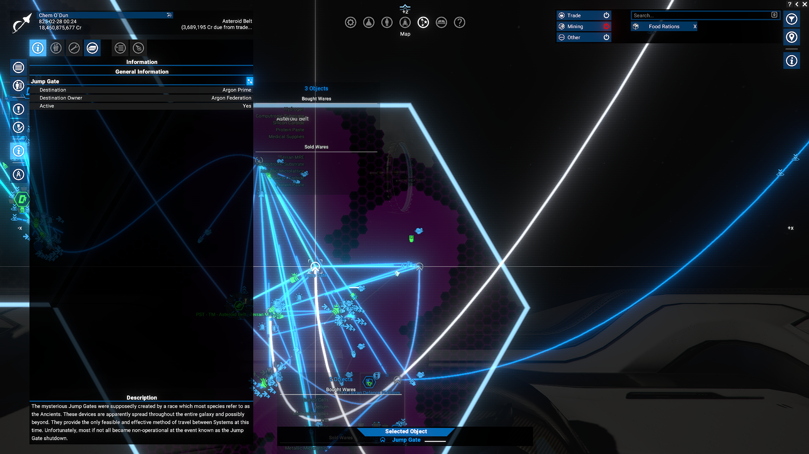

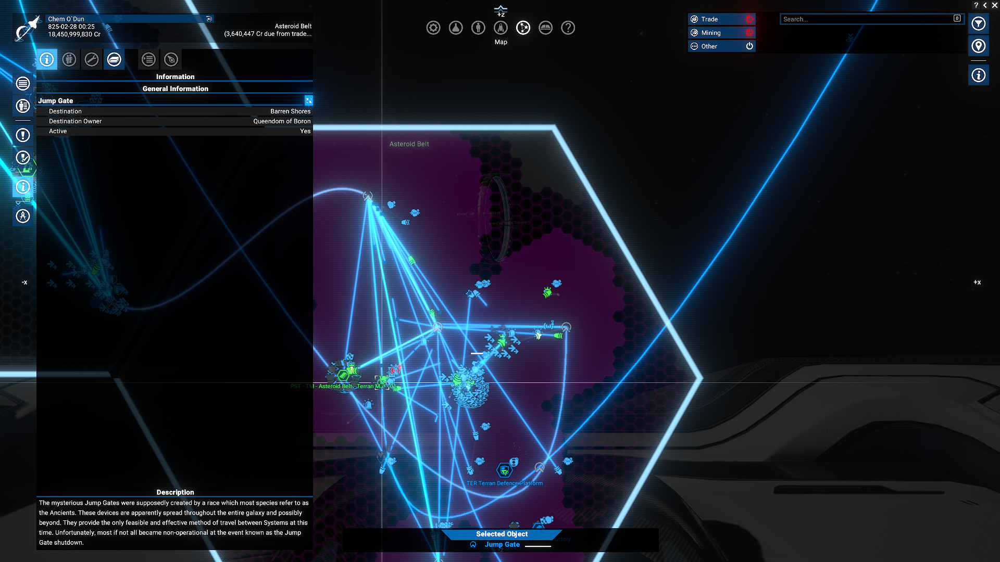

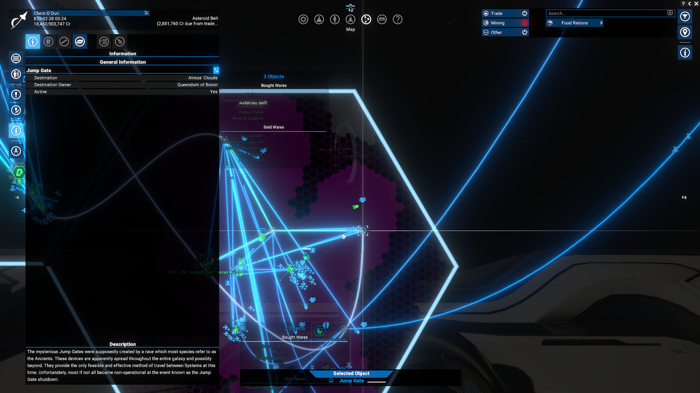

## Additional links

There is a topic on the [Egosoft forum](https://forum.egosoft.com/viewtopic.php?p=5262362) about the tool.